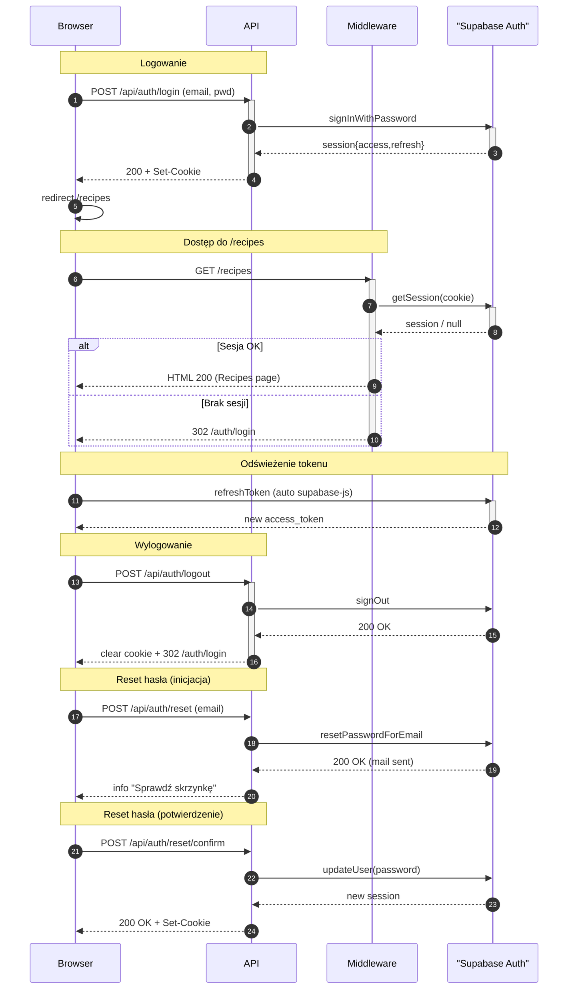

<authentication_analysis>

1. Główne przepływy autentykacji:
   • Logowanie (email/username + hasło) z automatycznym zalogowaniem.
   • Rejestracja nowego użytkownika (tworzy konto i loguje).
   • Reset hasła – inicjacja (email) i potwierdzenie (zmiana hasła).
   • Wylogowanie (unieważnienie sesji).
   • Dostęp do chronionych stron (guard + middleware).
   • Odświeżanie tokenu (access ↔ refresh) zarządzane przez Supabase.

2. Aktorzy i interakcje:
   • Browser – formularze React, supabase-js, pliki cookie.
   • API – endpointy Astro `/api/auth/*`, proxy do Supabase Auth.
   • Middleware – `src/middleware/index.ts`, dodaje `locals.session`.
   • Auth – usługa Supabase Auth (weryfikacja, sesje, e-maile).
   • Opcjonalnie Mail – serwer pocztowy obsługujący link resetu.

3. Weryfikacja i odświeżanie tokenów:
   • Po pomyślnym logowaniu/odświeżeniu Auth zwraca
   `access_token` (JWT, ~1h) i `refresh_token` (długi).
   • Cookie ustawiane przez API są odczytywane przez supabase-js
   po stronie klienta oraz przez Middleware po stronie serwera.
   • Przy każdym SSR `middleware` wywołuje `auth.getSession()`,
   co w razie potrzeby automatycznie odświeża token.
   • Gdy odświeżenie nie powiedzie się (revoked/expired), guard
   przekierowuje do `/auth/login`.

4. Kroki autentykacji (skrót):
   a. Login: Browser → API → Auth ✅ sesja → cookie → redirect.
   b. Register: Browser → API → Auth (signUp) ✅ sesja → cookie.
   c. Reset start: Browser → API → Auth (resetPasswordForEmail) →
   Mail → użytkownik.
   d. Reset confirm: Browser (z tokenami) → API → Auth (update pwd)
   ✅ nowa sesja.
   e. Logout: Browser → API → Auth (signOut) → czyszczenie cookie.
   f. Guard: Browser → Middleware → Auth (getSession) • redirect.
   </authentication_analysis>

<mermaid_diagram>

</mermaid_diagram>
