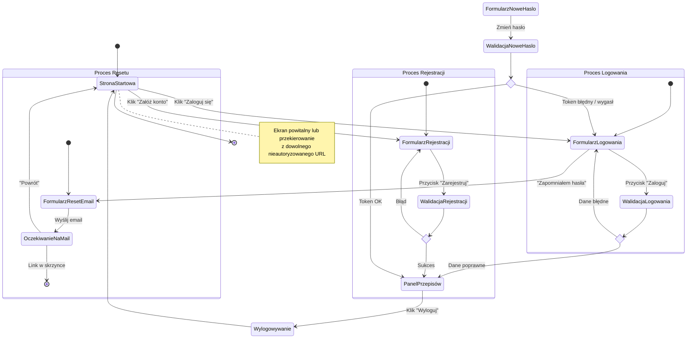

<user_journey_analysis>

1. Zidentyfikowane ścieżki (PRD US-001…US-004):
   • Rejestracja nowego konta.
   • Logowanie istniejącego użytkownika.
   • Odzyskiwanie zapomnianego hasła (reset 2-etapowy).
   • Wylogowanie z aplikacji.
   • Dostęp do funkcji chronionych (lista przepisów) dla zalogowanych.

2. Główne stany podróży:
   • StanPoczątkowy – użytkownik niezalogowany na stronie startowej.
   • FormularzLogowania – wprowadza dane lub wybiera reset.
   • FormularzRejestracji – tworzy nowe konto.
   • WeryfikacjaDanych – walidacja pól & odpowiedź serwera.
   • PanelPrzepisów – lista/galeria własnych przepisów (chroniona).
   • FormularzResetEmail – podaje e-mail do resetu.
   • OczekiwanieNaMail – informacja o wysłaniu linku.
   • FormularzNoweHaslo – ustawienie nowego hasła.
   • Wylogowywanie – potwierdzenie & czyszczenie sesji.
   • StanKoncowy – zakończenie sesji lub powrót na start.

3. Punkty decyzyjne / alternatywy:
   • if_login_ok – dane logowania poprawne/niepoprawne.
   • if_register_ok – rejestracja powiodła się/błąd.
   • if_reset_token – token poprawny/nie.

4. Cel stanów (skrót):
   • Formularze – zbieranie danych i walidacja client-side.
   • Weryfikacje – komunikacja z API/Supabase.
   • PanelPrzepisów – główna wartość aplikacji.
   • Wylogowywanie – zapewnienie prywatności.
   </user_journey_analysis>

<mermaid_diagram>

</mermaid_diagram>
