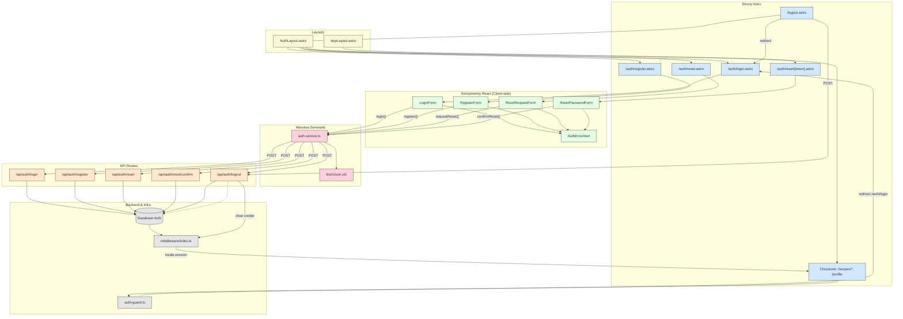

<architecture_analysis>

1. Komponenty odnalezione w codebase i specyfikacji:
   • LoginForm, RegisterForm, ResetRequestForm, ResetPasswordForm, AuthErrorAlert (React)
   • AuthLayout.astro, AppLayout.astro (Astro Layouts)
   • Strony Astro: /auth/login, /auth/register, /auth/reset, /auth/reset/[token], /logout, /recipes/_ (chronione), /profile (chroniona)
   • Middleware: src/middleware/index.ts (dodaje supabase + session)
   • Serwisy: auth.service.ts (klient), auth-guard.ts (SSR guard), logger.ts
   • API endpoints: /api/auth/_ (login, register, reset, reset-confirm, logout)
   • SupabaseClient (src/db/supabase.client.ts)
   • Istniejące strony korzystające z autentykacji: profile.astro, recipes/new.astro, recipes/[id]/edit.astro (TODO komentarze)

2. Mapa stron ↔ komponentów:
   • /auth/login → AuthLayout + <LoginForm />
   • /auth/register → AuthLayout + <RegisterForm />
   • /auth/reset → AuthLayout + <ResetRequestForm />
   • /auth/reset/[token] → AuthLayout + <ResetPasswordForm />
   • /logout → akcja serwerowa signOut + redirect
   • Strony chronione (/recipes/\*\*, /profile) używają AppLayout oraz guard requireAuth()

3. Przepływ danych (przykład logowania):
   LoginForm → walidacja client-side → auth.service.login (fetch POST /api/auth/login) → endpoint login.ts → Supabase signInWithPassword → cookie sesji → middleware zapisuje session → serwer zwraca JSON → LoginForm odbiera → Router przechodzi do /recipes.
   Analogiczny przepływ dla rejestracji (RegisterForm → signUp).

4. Opis funkcjonalności kluczowych komponentów:
   • LoginForm – zarządzanie stanem pól (email, hasło), walidacja, obsługa błędów, dispatch do API.
   • RegisterForm – zarządzanie stanem pól (email, hasło, confirmPassword), walidacja, obsługa błędów, dispatch do API.
   • AuthErrorAlert – prezentacja błędu;
   • AuthLayout – uproszczony layout bez głównej nawigacji;
   • AppLayout – layout z nawigacją i linkiem Wyloguj;
   • middleware/index – injekcja supabase i session do locals;
   • auth-guard – SSR redirect jeśli brak sesji;
   • Endpoints – cienka warstwa proxy do Supabase;
   • auth.service – abstrakcja fetch do API;
   </architecture_analysis>

<mermaid_diagram>

</mermaid_diagram>
